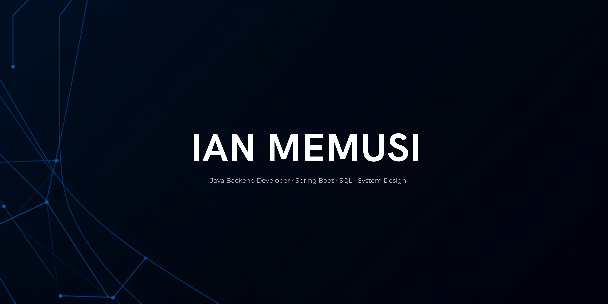

<p align="center">
  
</p>

<p align="center">
  <strong>Software Developer • Java Backend • Spring Boot • SQL</strong>
</p>

<p align="center">
  Building reliable backend systems, REST APIs, and database-driven applications with a focus on clean architecture and maintainable code.
</p>

<p align="center">
  <a href="https://github.com/1an-muusty">
    
  </a>
</p>

---

## About Me

I'm a Software Development student focused on backend engineering, especially Java, Spring Boot, SQL, and system design.

I enjoy building applications that solve practical problems through clean code, structured architecture, and efficient database design.

```text
ROLE        Software Developer

FOCUS       Java Backend Development

STACK       Java • Spring Boot • SQL

ALSO        Python • Django • Web Development

INTERESTS   REST APIs
            System Design
            Software Architecture
            Database Design

GOAL        Build scalable software systems
            that create real-world impact.
```

---

# Tech Stack

### Languages

<p align="center">

</p>

### Backend & Frameworks

<p align="center">

</p>

### Databases

<p align="center">

</p>

### Tools

<p align="center">

</p>

---

# GitHub Statistics

<p align="center">

</p>

<p align="center">

</p>

<p align="center">

</p>

---

# Featured Projects

## 🌍 Missing Person Database

A web-based system for reporting and managing missing-person records with authentication and database integration.

**Technologies:** Django • Python • MySQL • Bootstrap

---

## 🦖 Chrome Dinosaur Clone

A Java recreation of the Chrome Dinosaur game focused on object-oriented programming, game loops, collision detection, and Java architecture.

**Technologies:** Java

---

## 📚 Simple Library Management System

A desktop CRUD application for managing books and records with persistent local storage.

**Technologies:** Python • SQLite • GUI

---

## 🌦 Weather Application

A JavaFX application that retrieves and displays weather information through a user-friendly interface.

**Technologies:** Java • JavaFX

---

## ☕ Java Practice Projects

A collection of Java projects exploring:

* Object-Oriented Programming
* Collections
* Algorithms
* Data Structures
* Exception Handling
* File Handling

**Technologies:** Java

---

# Current Focus

* Java Backend Development
* Spring Boot REST APIs
* SQL Database Design
* System Design
* Software Architecture
* Clean Code Practices

---

# Connect

<p align="center">

<a href="https://github.com/1an-muusty">

</a>

<a href="mailto:1anmuusty@gmail.com">

</a>

<a href="https://www.linkedin.com/in/ian-memusi-7b124a340/">

</a>

</p>

---

<p align="center">
<i>Clean code. Scalable systems. Continuous improvement.</i>
</p>
